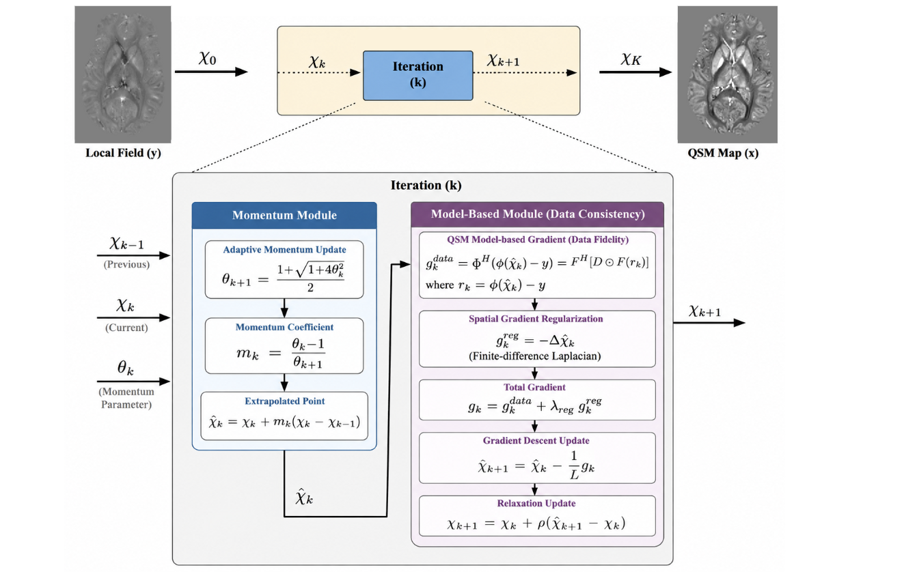

# Momentum-Accelerated Model-Based Quantitative Susceptibility Mapping


## Overview

This repository contains the implementation of **MA-Mo-QSM (Momentum-Accelerated Model-Based Quantitative Susceptibility Mapping)**, a physics-based iterative framework that incorporates **Nesterov momentum** into model-based dipole inversion to accelerate the reconstruction process.

The proposed approach focuses on accelerating the optimization trajectory while retaining the underlying dipole forward model and data-fidelity formulation.


## Proposed Framework

### Momentum-Accelerated Model-Based QSM (MA-Mo-QSM)

<p align="center">

</p>


---

## Repository Structure

```
Accelerated-QSM/
│
├── MA_MO_QSM_main.py          # Main script for Momentum-Accelerated QSM
├── models.py                  # Model definitions for MA-Mo-QSM and RRE-QSM
├── utils.py                   # QSM utilities, losses, dipole kernel, visualization
├── modules/
│   └── metrics.py             # Quantitative evaluation metrics
│
├── savedModels/               # Reconstruction outputs (generated automatically)
│
└── README.md
```

---

## Requirements

The implementation has been tested using

- Python 3.12
- PyTorch 2.4+
- CUDA 12.x

Install the required packages using

```bash
pip install torch numpy scipy pandas matplotlib
```

---

## Dataset

The implementation expects the following dataset structure:

```
QSM_data/
└── data_for_experiments/
    └── given_data/
        └── raw_data_names_modified/
            ├── patient_1/
            ├── patient_2/
            ├── ...
            └── patient_12/
```

Each patient folder should contain

```
phs1.mat
phs2.mat
...

msk1.mat
...

mag1.mat
...

cos1.mat
...
```

where

- **phs** : Local field map
- **msk** : Brain mask
- **mag** : Magnitude image
- **cos** : COSMOS susceptibility map (ground truth)

---

# Running MA-Mo-QSM

Run

```bash
python MA_MO_QSM_main.py
```

This script performs

- Momentum-accelerated model-based reconstruction
- Quantitative evaluation
- Saves reconstructed susceptibility maps
- Exports reconstruction metrics as CSV

---


## Output

For each experiment the repository generates

```
savedModels/
└── Experiment_Name/
    ├── patient_1_orientation_1.mat
    ├── patient_1_orientation_2.mat
    ├── ...
    ├── momentum_qsm_results.csv
    └── qsm_results.csv
```

---

## Evaluation Metrics

The following metrics are computed automatically.

- SSIM
- PSNR
- RMSE
- HFEN

---


 

## License

This repository is released for academic research purposes.

---

## Contact

**Vaddadi Venkatesh**

Department of Computational and Data Sciences

Indian Institute of Science (IISc)

Bengaluru, India

Email: *venkateshvaddadi254@gmail.com*
